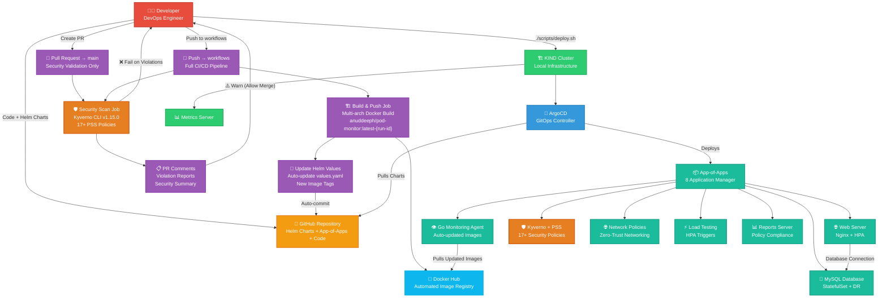

# 🚀 DevOps Case Study: Production-Grade Microservices on Kubernetes

> **A comprehensive demonstration of modern DevOps practices featuring GitOps, Policy-as-Code, automated security, disaster recovery, and horizontal scaling.**

## 📋 Table of Contents

- [🎯 Overview](#-overview)
- [🏗️ Architecture](#️-architecture) 
- [🛠️ Technology Stack](#️-technology-stack)
- [✨ Key Features](#-key-features)
- [🚀 Quick Start](#-quick-start)
- [📁 Project Structure](#-project-structure)
- [🔧 Components](#-components)
- [🔐 Security](#-security)
- [📊 Monitoring](#-monitoringls)
- [🎛️ Operations](#️-operations)
- [📚 Documentation](#-documentation)

## 🎯 Overview

This case study demonstrates a **production-grade microservices architecture** deployed on Kubernetes using modern DevOps practices. It showcases:

- **GitHub Actions CI/CD Pipeline** with automated build, security scan & deployment
- **GitOps deployment** with ArgoCD and App-of-Apps pattern
- **Security-First Approach** with Kyverno CLI scanning in CI/CD
- **Balanced Security Policy**: Fail on protected branches, warn on PRs
- **Automated Helm Values Management** with image tag updates
- **Kubernetes Cluster**: KIND cluster with Docker Hub registry  
- **Database Deployment**: MySQL with persistent storage & backup automation
- **Web Server**: Nginx with multiple replicas and custom features 
- **Pod Monitoring**: Golang application with automated builds
- **Helm Charts**: Complete application packaging with 8+ components
- **Policy-as-Code** with Kyverno for 17+ Pod Security Standards
- **Network policy automation** for zero-trust networking
- **Load Testing**: Automated load generation for HPA demonstration 
- **Disaster Recovery**: Comprehensive DR plan with automated backups
- **Horizontal pod autoscaling** with metrics-driven scaling 

## 🏗️ Architecture



### 🔄 **Modern CI/CD Flow:**

#### **🔀 Pull Request Workflow (Security Validation):**
1. **👨‍💻 Developer** creates PR with code/Helm changes → **⚡ GitHub Actions** triggers
2. **🛡️ Kyverno Security Scan** validates all Helm templates against Pod Security Standards  
3. **📋 PR Comments** show detailed security report with violation details
4. **⚠️ Warnings Only** - PRs can merge with violations (allows iterative development)

#### **🚀 Production Deployment (workflows branch):**
1. **👨‍💻 Developer** pushes to `workflows` branch → **⚡ Full CI/CD Pipeline** triggers
2. **🏗️ Build & Push** - Go monitoring agent built and pushed to Docker Hub with unique tags
3. **🔄 Helm Values Update** - Automated update of `values.yaml` with new image tags
4. **🛡️ Security Scan** - All templates validated against 17+ Pod Security Standards
5. **❌ Strict Enforcement** - Pipeline FAILS on any security violations
6. **📦 ArgoCD Sync** - GitOps controller deploys updated Helm charts automatically

#### **🎯 Infrastructure Setup:**
1. **🔧 deploy.sh** creates KIND cluster and installs ArgoCD + Metrics Server  
2. **🎯 ArgoCD** pulls Helm charts from GitHub and deploys App-of-Apps pattern
3. **📦 App-of-Apps** manages and deploys all 8 applications using Helm charts
4. **👁 Go Monitoring Agent** automatically pulls latest built images from Docker Hub

### Network Security (Auto-Generated via Kyverno)
```
📍 Namespace: devops-case-study
├── 🔒 default-deny-all (blocks all traffic)
├── 🌐 allow-dns (DNS resolution)
├── 💾 allow-web-to-database (web→db on port 3306)
├── 📊 allow-monitoring-access (monitoring→all services)
├── 🔄 allow-load-testing-access (load-tester→web-server)
└── 📡 allow-web-server-ingress (external→web-server on port 8080)
```

## 🛠️ Technology Stack

| Component | Technology | Purpose |
|-----------|------------|---------|
| **Container Orchestration** | Kubernetes (KIND) | Local cluster management |
| **Package Management** | Helm 3 | Application templating & deployment |
| **GitOps** | ArgoCD | Declarative continuous delivery |
| **Policy Engine** | Kyverno | Policy-as-Code & security automation |
| **Service Mesh Security** | NetworkPolicies | Zero-trust networking |
| **Database** | MySQL 8.0 | Persistent data storage |
| **Monitoring** | Custom Pod Monitor
| **Load Testing** | Custom load generator | Performance validation |
| **Backup** | mysqldump + CronJob | Disaster recovery |
| **CI/CD Pipeline** | GitHub Actions | Automated build, scan & deploy |
| **Security Scanning** | Kyverno CLI v1.15.0 | Policy compliance validation |

## ✨ Key Features

### ⚡ **GitHub Actions CI/CD Pipeline**

**Modern automation replacing manual deployment scripts with enterprise-grade CI/CD:**

#### **🔀 Workflow Triggers:**
```yaml
# Pull Request Validation
on:
  pull_request:
    branches: ['main']
    paths: ['monitoring-go-controller/**', 'helm-charts/**']

# Production Deployment  
on:
  push:
    branches: ['workflows']
    paths: ['monitoring-go-controller/**', 'helm-charts/**']
```

#### **📊 Pipeline Jobs:**

| **Job** | **PR→main** | **Push→workflows** | **Purpose** |
|---------|-------------|-------------------|-------------|
| **🏗️ Build & Push** | ⏭️ Skipped | ✅ Runs | Multi-arch Docker builds with unique tags |
| **🔄 Helm Update** | ⏭️ Skipped | ✅ Runs | Auto-update `values.yaml` with new image tags |
| **🛡️ Security Scan** | ✅ Runs | ✅ Runs | Kyverno CLI validates all Helm templates |
| **📋 PR Comments** | ✅ Runs | ⏭️ Skipped | Detailed violation reports in PR comments |
| **❌ Failure Policy** | ⚠️ **Warn** | ❌ **Fail** | Balanced enforcement for development vs production |

#### **🛡️ Security Integration:**
- **Kyverno CLI v1.15.0** scans all Helm chart outputs against Pod Security Standards
- **17+ Policies Applied**: Baseline + Restricted PSS compliance
- **Template Validation**: Scans desired state (Helm templates) vs runtime violations
- **Detailed Reporting**: Violation count, affected charts, and actionable remediation steps

#### **🎯 Automated Image Management:**
```bash
# Unique tag generation for each build
IMAGE_TAG="latest-${github.run_id}-${github.run_number}"

# Multi-platform builds
docker buildx build --platform linux/amd64,linux/arm64

# Automated Helm values update  
sed -i "s/tag: \".*\"/tag: \"$IMAGE_TAG\"/g" helm-charts/monitoring/values.yaml
```

### 🤖 **Automated Security (Policy-as-Code)**
- **17 Pod Security Standards** policies (Baseline + Restricted)
- **10 NetworkPolicies** auto-generated based on pod labels
- **Zero-touch security** for existing and new resources
- **Background scanning** every 1 minute for policy enforcement

### 🔄 **GitOps Deployment**
- **App-of-Apps pattern** with sync waves
- **Automated rollbacks** on health check failures
- **Drift detection** and self-healing
- **Multi-environment support** ready

### 🛡️ **Disaster Recovery**
- **Automated daily backups** via CronJob
- **Point-in-time recovery** capability
- **Backup verification** jobs
- **Cross-AZ backup storage** simulation

### 📈 **Auto-Scaling & Performance**
- **Horizontal Pod Autoscaler** (2-10 replicas, 70% CPU target)
- **Load testing suite** with configurable concurrency
- **Resource optimization** with requests/limits
- **Performance metrics** collection

## 🚀 Quick Start

### Prerequisites
- **Docker** & **KIND** installed
- **kubectl** configured
- **Helm 3** installed
- **Git** access to this repository

### 1️⃣ Deploy Infrastructure
```bash
# Clone and navigate to project
git clone https://github.com/anuddeeph1/devops-k8s-case-study.git
cd devops-k8s-case-study

# Deploy everything with one command
./scripts/deploy.sh gitops

# Monitor deployment progress
watch kubectl get applications -n argocd
```

### 2️⃣ Verify Deployment
```bash
# Check all services are running
kubectl get pods -n devops-case-study

# Verify ArgoCD applications are synced
kubectl get applications -n argocd

# Test web application
kubectl port-forward svc/web-server 8080:8080 -n devops-case-study
curl http://localhost:8080
```

### 3️⃣ Explore Features
```bash
# View auto-generated NetworkPolicies
kubectl get networkpolicies -n devops-case-study

# Check Pod Security policies  
kubectl get clusterpolicies

# Monitor HPA scaling
kubectl get hpa -n devops-case-study

# Check security violations (if any)
kubectl get policyreports -A
```

### 🔄 **CI/CD Development Workflow:**
```bash
# 1. Make changes to monitoring app or Helm charts
echo "// Updated monitoring logic" >> monitoring-go-controller/main.go

# 2. Create PR to main → Triggers security validation workflow
git checkout -b feature/monitoring-update
git add . && git commit -m "Update monitoring logic"
git push origin feature/monitoring-update
# → GitHub Actions runs security scan and reports violations in PR

# 3. Push to workflows branch → Triggers full CI/CD pipeline  
git checkout workflows
git merge feature/monitoring-update  
git push origin workflows
# → Builds image, updates Helm values, validates security, deploys via ArgoCD
```

## 📁 Project Structure

```
musical-giggle/
├── 📋 README.md                          # This file
├── 🚀 Scripts/                           # Deployment script
│   ├── 🚀 deploy.sh                      # Main Deployment Scripts
│   ├── 🚀 setup-cluster.sh
│   ├── 📋 kind-cluster-config.yaml 
|
├── 📦 helm-charts/                       # Helm chart templates
│   ├── 🌐 web-server/                    # Frontend microservice
│   ├── 💾 database/                      # MySQL with DR
│   ├── 📊 monitoring/                    # Metrics collection
│   ├── 🔄 load-testing/                  # Performance testing
│   ├── 🛡️ pss-policies/                  # Pod Security Standards
│   ├── 🔒 network-policies/              # NetworkPolicy generators
│   ├── 🔒 reports-server/               # Reports-server
│   └── ⚡ kyverno/                       # Policy engine
│
├── 🎛️ argocd-apps/                       # GitOps applications
│   ├── 📋 app-of-apps.yaml              # Master application
│   ├── 🌐 web-server-app.yaml           # Web service deployment
│   ├── 💾 database-app.yaml             # Database deployment  
│   ├── 📊 monitoring-app.yaml           # Monitoring deployment
│   ├── 🔄 load-testing-app.yaml         # Load testing deployment
│   ├── ⚡ kyverno-app.yaml              # Policy engine deployment
│   ├── 📊 reports-server-app.yaml       # Policy reporting
│   ├── 🛡️ kyverno-pss-app.yaml          # Security policies
│   └── 🔒 network-policies-app.yaml     # Network security
│
└── 📚 docs/                             # Additional documentation
    ├── 📊 DISASTER_RECOVERY_TESTING_GUIDE.md # DR procedures
    ├── 📊 DISASTER_RECOVERY_PLAN.md # DR procedures

```

## 🔧 Components

### 🌐 **Web Server** (`helm-charts/web-server/`)
- **Technology**: Node.js application
- **Scaling**: HPA enabled (2-10 replicas)
- **Health Checks**: Liveness & readiness probes
- **Networking**: Ingress + NetworkPolicy secured

### 💾 **Database** (`helm-charts/database/`)
- **Technology**: MySQL 8.0
- **Persistence**: 20Gi PVC with backup
- **Security**: Secret-managed credentials
- **Disaster Recovery**: Automated backups + restore procedures

### 📊 **Monitoring** (`helm-charts/monitoring/`)
- **Technology**: Custom Prometheus-style metrics
- **RBAC**: Service account with monitoring permissions
- **Networking**: Access to all services for metrics collection

### 🔄 **Load Testing** (`helm-charts/load-testing/`)
- **Technology**: Custom load generator
- **Configuration**: Configurable concurrency & duration
- **Purpose**: HPA demonstration & performance validation

## 🔐 Security

### 🛡️ **Pod Security Standards**
```yaml
# Applied automatically via Kyverno
Baseline Policies: 11 (disallow-privileged, restrict-capabilities, etc.)
Restricted Policies: 6 (require-non-root, disallow-privilege-escalation, etc.)
Mode: Audit (configurable to Enforce)
```

### 🔒 **Network Security**
- **Default Deny All**: Blocks all traffic by default
- **Principle of Least Privilege**: Only required connections allowed
- **Automatic Generation**: Policies created based on pod labels
- **Zero-Trust Architecture**: Every connection explicitly authorized

### 🔑 **Secret Management**
- **Kubernetes Secrets**: Database credentials
- **Helm Integration**: Template-driven secret generation
- **Backup Encryption**: Secure backup procedures

## 📊 Monitoring

### 📈 **Metrics Collection**
- **Application Metrics**: Custom HTTP endpoints
- **Resource Metrics**: CPU, memory, network usage
- **Policy Metrics**: Security policy violations

### 🔍 **Health Monitoring**
- **Liveness Probes**: Application health checks
- **Readiness Probes**: Service availability checks
- **ArgoCD Health**: GitOps deployment status

## 🎛️ Operations

### 📋 **Daily Operations**
```bash
# Check system health
kubectl get applications -n argocd
kubectl get pods -n devops-case-study

# View security violations
kubectl get policyreports -A

# Monitor scaling
kubectl get hpa -n devops-case-study
```

### 🔄 **Disaster Recovery**
```bash
# Manual backup (automated via CronJob)
kubectl create job --from=cronjob/devops-database-backup-cronjob manual-backup-$(date +%s) -n devops-case-study

# Restore from backup
kubectl apply -f helm-charts/database/job-templates/backup-restore-job.yaml
```

### 🚀 **Scaling Operations**
```bash
# Manual scaling
kubectl scale deployment web-server --replicas=5 -n devops-case-study

# HPA status
kubectl describe hpa web-server-hpa -n devops-case-study
```

## 📚 Documentation

| Document | Description |
|----------|-------------|
| [`DISASTER_RECOVERY_TESTING_GUIDE.md`](DISASTER_RECOVERY_TESTING_GUIDE.md) | Complete DR procedures |
| [`helm-charts/*/README.md`](helm-charts/) | Individual service documentation |
| [`docs/ARCHITECTURE.md`](docs/ARCHITECTURE.md) | System design deep-dive |
| [`docs/SECURITY.md`](docs/SECURITY.md) | Security implementation details |
| [`docs/OPERATIONS.md`](docs/OPERATIONS.md) | Operational procedures |

---

## 🎯 **Learning Outcomes**

After completing this case study, you will understand:

- ✅ **GitOps** deployment patterns with ArgoCD
- ✅ **Policy-as-Code** implementation with Kyverno
- ✅ **Zero-trust networking** with automated NetworkPolicies
- ✅ **Disaster recovery** strategies for stateful services
- ✅ **Horizontal pod autoscaling** configuration
- ✅ **Helm chart** templating and best practices
- ✅ **Kubernetes security** with Pod Security Standards
- ✅ **Production-grade** microservices architecture

## 🤝 **Contributing**

1. Fork the repository
2. Create a feature branch: `git checkout -b feature/amazing-feature`
3. Commit changes: `git commit -m 'Add amazing feature'`
4. Push to branch: `git push origin feature/amazing-feature`
5. Open a Pull Request

## 📝 **License**

This project is licensed under the MIT License - see the [LICENSE](LICENSE) file for details.

---

#### **🚀 GitOps Excellence**
- ✅ **8 Applications** deployed via ArgoCD App-of-Apps pattern
- ✅ **All Applications SYNCED** and HEALTHY
- ✅ **Monitoring Built from Source** - `monitoring-go-controller` successfully compiled and deployed
- ✅ **Zero Manual Intervention** - Complete GitOps workflow

#### **🛡️ Security Mastery**  
- ✅ **27 Active Policies** (17 PSS + 10 NetworkPolicies)
- ✅ **Pod Security Standards** - Baseline + Restricted compliance
- ✅ **Auto-Generated NetworkPolicies** with `generateExisting: true`
- ✅ **Zero-Trust Networking** securing database access

#### **📊 Production Operations**
- ✅ **StatefulSet MySQL** with automatic storage provisioning  
- ✅ **HPA Auto-Scaling** (3-10 replicas, CPU/Memory triggers)
- ✅ **Load Testing** with RBAC-enabled monitoring
- ✅ **Disaster Recovery** backup/restore automation ready

#### **🔧 Technical Implementation**
- ✅ **13 Kyverno Pods** running (admission, background, cleanup, reports controllers)
- ✅ **10 NetworkPolicies** automatically generated and applied
- ✅ **MySQL StatefulSet** with `volumeClaimTemplates` 
- ✅ **Source Code Pipeline** - Go monitoring app built from `./monitoring-go-controller`

### 🎯 **Demo-Ready Features**

| Feature | Status | Demo Command |
|---------|--------|--------------|
| **Web App** | ✅ Running | `open http://localhost:8080` |
| **ArgoCD UI** | ✅ Ready | `open https://localhost:8081` |  
| **HPA Scaling** | ✅ Active | `kubectl create job --from=cronjob/load-test-job demo` |
| **Policy Compliance** | ✅ Clean | `kubectl get policyreports -A` |
| **Network Security** | ✅ Enforced | `kubectl get networkpolicies -n devops-case-study` |
| **DR Testing** | ✅ Ready | `kubectl create job --from=cronjob/mysql-backup-job test` |

### 🚀 **Ready For:**
- ✅ **Technical Interviews** - Full GitOps + Modern CI/CD + Policy-as-Code demonstration
- ✅ **Production Deployment** - Enterprise-grade pipeline with automated security scanning
- ✅ **Architecture Reviews** - Modern microservices with GitHub Actions automation
- ✅ **DevOps Showcases** - Complete CI/CD pipeline with balanced security enforcement
- ✅ **Security Audits** - Kyverno CLI integration with 17+ Pod Security Standards
- ✅ **Team Collaboration** - PR-based workflow with automated validation and reporting

---

**💡 This case study demonstrates mastery of modern DevOps practices with production-ready CI/CD automation!**

**Built with ❤️ for the DevOps community** 🚀# Trigger workflow test - Sat Sep  6 18:51:36 IST 2025
