# 🎛️ ArgoCD Applications

> **GitOps deployment manifests for complete microservices infrastructure with policy-as-code**

## 📋 Overview

This directory contains ArgoCD Application manifests that implement:
- **App-of-Apps pattern** for centralized application management
- **Sync waves** for proper deployment ordering
- **Automated sync policies** with self-healing capabilities
- **Comprehensive drift detection** and correction
- **Policy-as-code integration** with Kyverno

## 🏗️ GitOps Architecture

```mermaid
graph TD
    DEV["👨‍💻 Developer"]

    GIT["📁 GitHub Repository<br/>Helm Charts + App-of-Apps + Code"]

    SCRIPT["🔧 deploy.sh Script<br/>Cluster + ArgoCD + Metrics + Build & Push Go Monitor image to docker hub"]

    KIND["🏗️ KIND Cluster"]

    METRICS["📊 Metrics Server"]

    ARGO["🎯 ArgoCD"]

    DOCKER["🐳 Docker Hub<br/>Go Monitor Image"]

    APPOFAPPS["📦 App-of-Apps<br/> Applications"]

    WEB["🌐 Web Server"]

    DB["💾 MySQL Database"]

    MON["👁 Go Monitoring Agent"]

    SEC["🛡 Kyverno + PSS Policies"]

    NETPOL["🌐 Network Policies"]

    TEST["⚡ Load Testing"]

    REPORTS["📊 Reports Server"]

    %% Flow
    DEV -->|"Push Charts + Code"| GIT
    DEV -->|"Run Script"| SCRIPT

    SCRIPT --> KIND
    SCRIPT --> METRICS
    SCRIPT --> ARGO
    SCRIPT -->|"Build & Push Image"| DOCKER

    ARGO -->|"Pulls from GitHub"| GIT
    ARGO -->|"Deploys"| APPOFAPPS

    %% App-of-Apps deploys
    APPOFAPPS --> WEB
    APPOFAPPS --> DB
    APPOFAPPS --> MON
    APPOFAPPS --> SEC
    APPOFAPPS --> NETPOL
    APPOFAPPS --> TEST
    APPOFAPPS --> REPORTS

    MON -->|"Image from"| DOCKER
    WEB -->|"Uses"| DB

    %% Styling
    classDef developer fill:#FF6B6B,stroke:#C0392B,stroke-width:2px,color:#fff
    classDef git fill:#2ECC71,stroke:#27AE60,stroke-width:2px,color:#fff
    classDef script fill:#E67E22,stroke:#D35400,stroke-width:2px,color:#fff
    classDef infrastructure fill:#3498DB,stroke:#2980B9,stroke-width:2px,color:#fff
    classDef gitops fill:#9B59B6,stroke:#8E44AD,stroke-width:2px,color:#fff
    classDef docker fill:#3498DB,stroke:#2980B9,stroke-width:2px,color:#fff
    classDef master fill:#F39C12,stroke:#E67E22,stroke-width:2px,color:#fff
    classDef apps fill:#1ABC9C,stroke:#16A085,stroke-width:2px,color:#fff

    class DEV developer
    class GIT git
    class SCRIPT script
    class KIND,METRICS infrastructure
    class ARGO gitops
    class DOCKER docker
    class APPOFAPPS master
    class WEB,DB,MON,SEC,NETPOL,TEST,REPORTS apps
```



### 🔄 **GitOps Deployment Flow:**
1. **👨‍💻 Developer** pushes Helm charts and Go monitoring code to GitHub
2. **🔧 deploy.sh** script creates KIND cluster, installs ArgoCD, builds and pushes Go monitoring image
3. **🎯 ArgoCD** pulls Helm charts from GitHub and deploys App-of-Apps
4. **📦 App-of-Apps** manages and deploys all 8 applications using Helm charts with sync waves
5. **👁 Go Monitoring Agent** pulls its container image from Docker Hub

### 📋 **Sync Wave Deployment Order:**
- **Wave 0**: Kyverno Core (Policy Engine)
- **Wave 1**: Reports Server (Policy Reporting) 
- **Wave 2**: PSS Policies (Pod Security Standards)
- **Wave 3**: Network Policies (Zero Trust Security)
- **Wave 4**: Applications (Web, Database, Monitoring, Load Testing)

## 📦 Applications Overview

### 🎭 **Master Application**

#### **app-of-apps.yaml** - Central Control
```yaml
# Manages all other applications
metadata:
  name: devops-case-study-apps
  namespace: argocd

# Deploys all applications from this directory
source:
  path: argocd-apps/
  directory:
    recurse: false  # Only top-level apps
```

### ⚡ **Infrastructure Applications** (Sync Waves 0-2)

#### **kyverno-app.yaml** - Policy Engine (Wave 0)
```yaml
# Deploys Kyverno core components first
annotations:
  argocd.argoproj.io/sync-wave: "0"
  
# Features:
- Custom BACKGROUND_SCAN_INTERVAL=1m for fast policy processing
- Full CRD installation for ClusterPolicy resources
- RBAC configuration for policy enforcement
```

#### **reports-server-app.yaml** - Policy Reporting (Wave 1)
```yaml
# Deploys after Kyverno core for policy reports
annotations:
  argocd.argoproj.io/sync-wave: "1"
  
# Features:
- PolicyReport and ClusterPolicyReport aggregation
- API server for policy violation queries
- Metrics integration with monitoring
```

#### **kyverno-pss-app.yaml** - Security Policies (Wave 2)
```yaml
# Deploys Pod Security Standards policies
annotations:
  argocd.argoproj.io/sync-wave: "2"
  
# Features:
- 17 PSS policies (11 Baseline + 6 Restricted)
- Configurable Audit/Enforce modes
- Comprehensive security coverage
```

#### **network-policies-app.yaml** - Network Security (Wave 3)
```yaml
# Deploys network policy generators last in infrastructure
annotations:
  argocd.argoproj.io/sync-wave: "3"
  
# Features:
- 10 NetworkPolicy generators via ClusterPolicies
- Automatic zero-trust network security
- generateExisting: true for existing resources
```

### 🚀 **Application Services** (Sync Wave 4)

#### **database-app.yaml** - Persistent Storage
```yaml
# MySQL with disaster recovery
source:
  path: helm-charts/database
  
# Features:
- Automated daily backups via CronJob
- 20Gi persistent storage
- Secret-managed credentials
- Disaster recovery procedures
```

#### **web-server-app.yaml** - Frontend Service
```yaml
# Web application with HPA
source:
  path: helm-charts/web-server
  
# Features:
- Horizontal Pod Autoscaler (2-10 replicas)
- Health checks and monitoring
- Ingress configuration
- NetworkPolicy integration
```

#### **monitoring-app.yaml** - Observability
```yaml
# Prometheus-style monitoring
source:
  path: helm-charts/monitoring
  
# Features:
- Custom metrics collection
- Service discovery
- RBAC for cluster access
- Dashboard integration ready
```

#### **load-testing-app.yaml** - Performance Testing
```yaml
# Load testing for HPA demonstration
source:
  path: helm-charts/load-testing
  
# Features:
- Configurable concurrent users
- CronJob scheduling
- HPA trigger capability
- Performance metrics collection
```

## 🔧 Common Configuration Patterns

### 🎯 **Sync Policies** (Applied to all apps)
```yaml
syncPolicy:
  automated:
    prune: true        # Remove orphaned resources
    selfHeal: true     # Fix configuration drift
  syncOptions:
    - CreateNamespace=true      # Auto-create target namespaces
    - ServerSideApply=true      # Use server-side apply
    - SkipDryRunOnMissingResource=true  # Handle CRD timing issues
  retry:
    limit: 5           # Retry failed syncs
    backoff:
      duration: 5s
      factor: 2
      maxDuration: 3m
```

### 🔍 **Ignore Differences** (Handle dynamic fields)
```yaml
ignoreDifferences:
- group: kyverno.io
  kind: ClusterPolicy
  jsonPointers:
    - /metadata/annotations      # Ignore ArgoCD annotations
    - /metadata/generation      # Ignore generation changes
    - /spec/skipBackgroundRequests  # Ignore Kyverno auto-additions
    - /status                   # Ignore status changes
```

## 🚀 Deployment Instructions

### 1️⃣ **Bootstrap ArgoCD**
```bash
# Install ArgoCD in cluster
kubectl create namespace argocd
kubectl apply -n argocd -f https://raw.githubusercontent.com/argoproj/argo-cd/stable/manifests/install.yaml

# Wait for ArgoCD to be ready
kubectl wait --for=condition=available --timeout=300s deployment/argocd-server -n argocd
```

### 2️⃣ **Deploy App-of-Apps**
```bash
# Apply master application
kubectl apply -f argocd-apps/app-of-apps.yaml

# Monitor deployment progress
watch kubectl get applications -n argocd
```

### 3️⃣ **Verify Deployment**
```bash
# Check all applications are synced and healthy
kubectl get applications -n argocd -o wide

# Check individual application details
kubectl describe application devops-case-study-apps -n argocd
```

## 📊 Application Status Monitoring

### ArgoCD UI Access
```bash
# Port forward to ArgoCD server
kubectl port-forward svc/argocd-server -n argocd 8080:443

# Get admin password
kubectl -n argocd get secret argocd-initial-admin-secret \
  -o jsonpath="{.data.password}" | base64 -d

# Access UI: https://localhost:8080
# Username: admin
# Password: <decoded-password>
```

### CLI Status Checks
```bash
# Application overview
kubectl get applications -n argocd

# Detailed application status
kubectl get applications -n argocd -o custom-columns=\
"NAME:.metadata.name,SYNC:.status.sync.status,HEALTH:.status.health.status"

# Check sync history
kubectl get applications devops-case-study-apps -n argocd -o yaml | \
  yq '.status.history'
```

## 🔧 Troubleshooting

### Application Not Syncing
```bash
# Check application events
kubectl describe application <app-name> -n argocd

# View application logs
kubectl logs -l app.kubernetes.io/name=argocd-application-controller \
  -n argocd --tail=50

# Force refresh
kubectl patch application <app-name> -n argocd --type json \
  -p='[{"op": "replace", "path": "/operation", "value": {"sync": {"revision": "HEAD"}}}]'
```

### Sync Wave Issues
```bash
# Check sync wave order
kubectl get applications -n argocd -o custom-columns=\
"NAME:.metadata.name,WAVE:.metadata.annotations.argocd\.argoproj\.io/sync-wave"

# Verify dependencies are ready
kubectl get applications -n argocd -o yaml | \
  grep -A 5 -B 5 "sync-wave"
```

### Health Check Failures
```bash
# Check resource health
kubectl get applications <app-name> -n argocd -o yaml | \
  yq '.status.resources[] | select(.health.status != "Healthy")'

# Verify target resources
kubectl get all -n <target-namespace>

# Check ArgoCD resource health definitions
kubectl get configmap argocd-cm -n argocd -o yaml | \
  grep -A 20 resource.customizations
```

## 🔄 GitOps Workflows

### Standard Deployment Flow
```bash
# 1. Code changes pushed to Git
git add .
git commit -m "Update application configuration"
git push origin gitops

# 2. ArgoCD detects changes (or manual sync)
kubectl get applications -n argocd -w

# 3. Automatic sync with self-healing
# Applications automatically deploy and fix drift
```

### Manual Sync Operations
```bash
# Sync specific application
kubectl patch application web-server -n argocd --type json \
  -p='[{"op": "replace", "path": "/operation", "value": {"sync": {"revision": "HEAD"}}}]'

# Sync all applications
for app in $(kubectl get applications -n argocd -o name); do
  kubectl patch $app -n argocd --type json \
    -p='[{"op": "replace", "path": "/operation", "value": {"sync": {"revision": "HEAD"}}}]'
done
```

### Rollback Procedures
```bash
# List application history
kubectl get application <app-name> -n argocd -o yaml | \
  yq '.status.history'

# Rollback to specific revision
kubectl patch application <app-name> -n argocd --type json \
  -p='[{"op": "replace", "path": "/operation", "value": {"sync": {"revision": "<commit-hash>"}}}]'
```

## 📋 Application Reference

| Application | Description | Sync Wave | Namespace | Dependencies |
|-------------|-------------|-----------|-----------|--------------|
| `app-of-apps` | Master app managing all others | - | argocd | None |
| `kyverno` | Policy engine core | 0 | kyverno | None |
| `reports-server` | Policy reporting | 1 | kyverno | kyverno |
| `kyverno-pss` | Pod Security Standards | 2 | kyverno | kyverno |
| `network-policies` | Network security generators | 3 | kyverno | kyverno |
| `database` | MySQL with DR | 4 | devops-case-study | None |
| `web-server` | Frontend with HPA | 4 | devops-case-study | database |
| `monitoring` | Metrics collection | 4 | devops-case-study | None |
| `load-testing` | Performance testing | 4 | devops-case-study | web-server |

## 🎯 Best Practices

### 🔒 **Security**
- Use **sync waves** to ensure security components deploy first
- Enable **automated pruning** to remove orphaned resources
- Set **proper RBAC** for ArgoCD service accounts
- Use **sealed secrets** or external secret management

### ⚡ **Performance**  
- Configure **appropriate retry policies** for transient failures
- Use **server-side apply** for large resources
- Set **resource limits** on ArgoCD components
- Monitor **sync frequency** and adjust as needed

### 🔄 **Operations**
- Implement **proper branching strategy** (gitops branch for deployments)
- Use **ignore differences** for fields that change frequently
- Set up **monitoring** for ArgoCD application health
- Document **rollback procedures** for each application

## 🔗 Integration Examples

### Slack Notifications
```yaml
# Add to argocd-notifications-cm ConfigMap
apiVersion: v1
kind: ConfigMap
metadata:
  name: argocd-notifications-cm
data:
  service.slack: |
    token: <slack-token>
  template.app-deployed: |
    message: |
      Application {{.app.metadata.name}} is now {{.app.status.sync.status}}.
  trigger.on-deployed: |
    - when: app.status.sync.status == 'Synced'
      send: [app-deployed]
```

### Prometheus Metrics
```bash
# ArgoCD metrics endpoint
kubectl port-forward svc/argocd-metrics -n argocd 8082:8082

# Example metrics:
curl http://localhost:8082/metrics | grep argocd_app
```

## 🔗 Related Documentation

- [📋 Main Project README](../README.md)
- [🌐 Web Server Helm Chart](../helm-charts/web-server/README.md)
- [💾 Database Helm Chart](../helm-charts/database/README.md)
- [📊 Monitoring Helm Chart](../helm-charts/monitoring/README.md)
- [🔄 Load Testing Helm Chart](../helm-charts/load-testing/README.md)
- [⚡ Kyverno Helm Chart](../helm-charts/kyverno/README.md)
- [🛡️ PSS Policies](../helm-charts/pss-policies/README.md)
- [🔒 Network Policies](../helm-charts/network-policies/README.md)

---

**🎛️ Complete GitOps deployment with App-of-Apps pattern and policy-as-code!** 🚀
