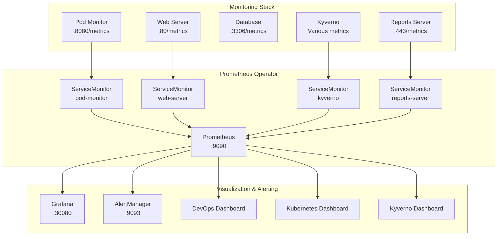

# 📊 Prometheus & Grafana Integration Guide

> **Complete observability stack with monitoring, alerting, and visualization for the DevOps case study**

## 🎯 Overview

This integration adds a comprehensive monitoring and observability stack to your Kubernetes environment with:

- **🔍 Prometheus Operator** - Complete monitoring solution with CRD-based management
- **📈 Grafana** - Rich visualization and dashboarding platform  
- **🚨 AlertManager** - Intelligent alerting and notification routing
- **📊 Custom Metrics** - Enhanced pod monitoring with Prometheus endpoints
- **🎛️ ServiceMonitors** - Automatic service discovery and metrics scraping
- **📋 Custom Dashboards** - Purpose-built dashboards for the microservices stack

## 🏗️ Architecture



## 🚀 Quick Start

### 1️⃣ Deploy Complete Stack

```bash
# Deploy everything (including new monitoring stack)
./scripts/deploy.sh gitops

# Monitor deployment progress
watch kubectl get applications -n argocd
```

### 2️⃣ Access Grafana Dashboard

```bash
# Get Grafana service (NodePort on 30080)
kubectl get svc -n devops-case-study | grep grafana

# Access Grafana UI
open http://localhost:30080

# Default credentials
Username: admin
Password: admin123
```

### 3️⃣ Verify Prometheus Targets

```bash
# Port forward to Prometheus
kubectl port-forward svc/prometheus-operated 9090:9090 -n devops-case-study

# Check targets
open http://localhost:9090/targets
```

## 📊 Available Dashboards

### **DevOps Case Study - Overview**
- **Pod lifecycle monitoring** with phase tracking
- **Event rate analysis** for pod creation/deletion/modification  
- **Resource utilization** (CPU/Memory) by pod
- **Service health** indicators
- **Pod monitor reconnection** tracking

### **Kubernetes Cluster Overview** (ID: 6417)
- **Cluster resource utilization**
- **Node performance metrics**
- **Namespace-level insights**

### **Kubernetes Pods** (ID: 6336)  
- **Pod-level CPU/Memory metrics**
- **Container restart tracking**
- **Pod status distribution**

### **Kyverno Policy Dashboard** (ID: 13995)
- **Policy compliance metrics**
- **Violation tracking**
- **Policy evaluation performance**

## 🚨 Configured Alerts

### **Critical Alerts**
| Alert | Condition | Description |
|-------|-----------|-------------|
| `PodMonitorDown` | Pod monitor not responding | Custom monitoring service failure |
| `WebServerDown` | Web server health check fails | Frontend service unavailable |
| `DatabaseDown` | Database health check fails | Backend data layer failure |

### **Warning Alerts**  
| Alert | Condition | Description |
|-------|-----------|-------------|
| `PodCrashLooping` | >1 restart in 5 minutes | Unstable pod behavior |
| `HighPodEventRate` | >5 events/sec | Unusual pod activity |
| `HighCPUUsage` | >80% CPU for 5 minutes | Resource saturation |
| `HighMemoryUsage` | >90% memory for 5 minutes | Memory pressure |
| `PodMonitorReconnecting` | Frequent API reconnections | API connectivity issues |

## 🔧 Configuration

### **Prometheus Configuration**
```yaml
# Storage: 10Gi persistent volume
# Retention: 15 days
# Scrape interval: 30s
# Resource limits: 2Gi memory, 1 CPU
```

### **Grafana Configuration**
```yaml
# Access: NodePort on 30080
# Storage: 5Gi persistent volume  
# Admin password: admin123
# Auto-imported dashboards: 4 dashboards
```

### **AlertManager Configuration**
```yaml
# Storage: 2Gi persistent volume
# Group wait: 10s
# Repeat interval: 1h
# Webhook endpoint: http://localhost:5001/webhook
```

## 📈 Custom Metrics Exposed

### **Pod Monitor Metrics** (`/metrics`)
- `pod_monitor_events_total` - Counter of pod events by type/phase
- `pod_monitor_active_pods` - Gauge of active pods by phase
- `pod_monitor_watcher_reconnects_total` - Counter of API reconnections
- `pod_monitor_last_event_timestamp` - Timestamp of last event

### **Example Queries**
```promql
# Pod event rate by type
rate(pod_monitor_events_total{namespace="devops-case-study"}[5m])

# Active pods in Running phase
pod_monitor_active_pods{namespace="devops-case-study",phase="Running"}

# API reconnection rate  
rate(pod_monitor_watcher_reconnects_total{namespace="devops-case-study"}[5m])

# High CPU usage pods
100 * (1 - avg(rate(container_cpu_usage_seconds_total{namespace="devops-case-study"}[5m])) by (pod)) > 80
```

## 🛠️ Troubleshooting

### **Prometheus Not Scraping Targets**
```bash
# Check ServiceMonitor configuration
kubectl get servicemonitor -n devops-case-study

# Verify service labels match ServiceMonitor selector
kubectl get svc -n devops-case-study --show-labels

# Check Prometheus operator logs
kubectl logs -n devops-case-study -l app.kubernetes.io/name=prometheus-operator
```

### **Grafana Dashboard Not Loading**
```bash
# Check Grafana pod status
kubectl get pods -n devops-case-study -l app.kubernetes.io/name=grafana

# Check ConfigMap for dashboards
kubectl get configmap -n devops-case-study | grep dashboard

# Port forward for debugging
kubectl port-forward svc/grafana 3000:80 -n devops-case-study
```

### **Custom Metrics Not Appearing**
```bash
# Test metrics endpoint directly
kubectl exec -it deployment/pod-monitor -n devops-case-study -- curl localhost:8080/metrics

# Check ServiceMonitor target status
kubectl port-forward svc/prometheus-operated 9090:9090 -n devops-case-study
# Go to http://localhost:9090/targets
```

### **Alerts Not Firing**
```bash
# Check AlertManager configuration
kubectl get prometheusrule -n devops-case-study

# View active alerts
kubectl port-forward svc/prometheus-operated 9090:9090 -n devops-case-study
# Go to http://localhost:9090/alerts

# Check AlertManager status
kubectl port-forward svc/alertmanager-operated 9093:9093 -n devops-case-study
```

## 🔄 GitOps Integration

### **Application Structure**
```yaml
# argocd-apps/prometheus-stack-app.yaml
- Prometheus Operator (wave 3)
- Enhanced pod monitor (wave 4) 
- ServiceMonitors for all services
- Custom Grafana dashboards
- AlertManager rules
```

### **Branch Strategy**
- **monitoring** branch: Contains all monitoring enhancements
- **Auto-sync**: Enabled with self-healing
- **Sync waves**: Ensures proper deployment order

## 📋 Access URLs

| Service | URL | Credentials |
|---------|-----|-------------|
| **Grafana** | http://localhost:30080 | admin / admin123 |
| **Prometheus** | kubectl port-forward svc/prometheus-operated 9090:9090 | N/A |
| **AlertManager** | kubectl port-forward svc/alertmanager-operated 9093:9093 | N/A |
| **Pod Monitor** | kubectl port-forward svc/pod-monitor 8080:8080 | N/A |

## 🎯 Next Steps

### **Enhancements You Can Add**
1. **Alert Routing** - Configure Slack/email notifications
2. **Custom Dashboards** - Add application-specific metrics
3. **Long-term Storage** - Configure remote storage (Thanos/Cortex)
4. **Multi-cluster** - Extend monitoring across environments
5. **SLI/SLO Monitoring** - Add reliability metrics

### **Production Considerations**
1. **Resource Planning** - Scale Prometheus storage and retention
2. **Security** - Enable authentication and RBAC for Grafana
3. **High Availability** - Deploy Prometheus in HA mode
4. **Backup Strategy** - Configure Grafana dashboard exports

---

## 🔗 Related Documentation

- [📋 Main Project README](../README.md)
- [🔧 Pod Monitor Documentation](../helm-charts/monitoring/README.md)
- [🚀 Prometheus Stack Chart](../helm-charts/prometheus-stack/)
- [📊 Custom Dashboard JSON](../helm-charts/prometheus-stack/templates/custom-dashboard.yaml)
- [🚨 Alert Rules](../helm-charts/prometheus-stack/templates/alerting-rules.yaml)

**📊 Complete observability stack ready for production workloads!**
