# 🛡️ Security Scanning Implementation Guide

> **Complete implementation of Grype, Syft, and VEX tools for container security scanning in a Kubernetes DevOps environment**

## 📋 Table of Contents

- [🎯 Overview](#-overview)
- [🔧 Tools Implemented](#-tools-implemented)
- [🚀 Quick Start](#-quick-start)
- [🏗️ Architecture](#️-architecture)
- [📦 Components](#-components)
- [🛠️ Usage Examples](#️-usage-examples)
- [🔐 Security Features](#-security-features)
- [📊 Reports & Outputs](#-reports--outputs)
- [🚨 Troubleshooting](#-troubleshooting)
- [🔗 Integration](#-integration)

## 🎯 Overview

This implementation adds comprehensive container security scanning to our DevOps case study using industry-standard tools:

- **Grype** - Vulnerability scanner for container images and filesystems
- **Syft** - Software Bill of Materials (SBOM) generator
- **VEX** - Vulnerability Exploitability eXchange document generator
- **Cosign** - Container signing and attestation

### Key Benefits

✅ **Automated Security** - Integrated into CI/CD pipeline  
✅ **Supply Chain Security** - SBOM generation and attestation  
✅ **Vulnerability Management** - Comprehensive scanning and reporting  
✅ **Compliance Ready** - NIST, SLSA, and industry standards support  
✅ **GitOps Compatible** - Seamless integration with ArgoCD workflow  

## 🔧 Tools Implemented

### 🔍 Grype (Vulnerability Scanner)
- **Purpose**: Scans container images for known vulnerabilities
- **Output Formats**: JSON, Table, SARIF
- **Database**: Updated vulnerability database from multiple sources
- **Severity Levels**: Critical, High, Medium, Low, Negligible

### 📋 Syft (SBOM Generator) 
- **Purpose**: Generates Software Bill of Materials
- **Output Formats**: CycloneDX, SPDX, Table
- **Component Detection**: Dependencies, packages, libraries, files
- **Metadata**: License information, version details, checksums

### 📑 VEX (Vulnerability Exploitability eXchange)
- **Purpose**: Documents vulnerability exploitability assessments
- **Standard**: OpenVEX v0.2.0 compliance
- **Integration**: Links SBOM components with vulnerability data
- **Statements**: Provides exploitability context for each CVE

### 🔏 Cosign (Container Signing)
- **Purpose**: Signs and attests container images and artifacts
- **Integration**: Keyless signing with GitHub OIDC
- **Attestations**: SBOM and VEX documents attached to images
- **Verification**: Cryptographic verification of signatures

## 🚀 Quick Start

### 1️⃣ Local Security Scanning

```bash
# Scan any container image locally
./scripts/security-scan.sh anuddeeph/pod-monitor:latest ./security-reports

# Run test suite with multiple images
./scripts/security-test.sh

# View results
cat ./security-reports/security-summary.md
```

### 2️⃣ CI/CD Pipeline Integration

The security scanning is automatically triggered on:
- **Push to `workflows` branch**: Full security scan with attestation
- **Pull Request to `main`**: Security validation and reporting

### 3️⃣ Container Build with Security

```bash
# Build container with security scanning enabled
cd monitoring-go-controller
./security-build.sh --push

# Build with custom settings
./security-build.sh --tag=secure-v1.0 --push --no-security-scan
```

## 🏗️ Architecture

```mermaid
graph TD
    DEV["👨‍💻 Developer"] --> CODE["📝 Code Changes"]
    CODE --> PR["🔀 Pull Request"]
    CODE --> PUSH["🚀 Push to workflows"]
    
    PR --> GHACTIONS["⚡ GitHub Actions"]
    PUSH --> GHACTIONS
    
    GHACTIONS --> BUILD["🏗️ Container Build"]
    BUILD --> SCAN["🔍 Security Scan"]
    
    SCAN --> GRYPE["🛡️ Grype<br/>Vulnerability Scan"]
    SCAN --> SYFT["📋 Syft<br/>SBOM Generation"]
    SCAN --> VEX["📑 VEX<br/>Document Creation"]
    
    GRYPE --> REPORTS["📊 Security Reports"]
    SYFT --> REPORTS
    VEX --> REPORTS
    
    REPORTS --> COSIGN["🔏 Cosign<br/>Attestation"]
    COSIGN --> REGISTRY["🐳 Container Registry<br/>with Attestations"]
    
    REGISTRY --> ARGOCD["🎯 ArgoCD<br/>GitOps Deployment"]
    ARGOCD --> K8S["☸️ Kubernetes<br/>Secure Deployment"]
    
    classDef developer fill:#E74C3C,stroke:#C0392B,color:#fff
    classDef security fill:#E67E22,stroke:#D35400,color:#fff
    classDef tools fill:#9B59B6,stroke:#8E44AD,color:#fff
    classDef output fill:#27AE60,stroke:#2ECC71,color:#fff
    
    class DEV developer
    class GRYPE,SYFT,VEX,COSIGN security
    class GHACTIONS,BUILD,SCAN tools
    class REPORTS,REGISTRY,ARGOCD,K8S output
```



## 📦 Components

### GitHub Actions Workflow Enhancement

**File**: `.github/workflows/build-monitoring-agent.yaml`

```yaml
jobs:
  container-security-scan:
    name: Container Security Analysis
    needs: build-and-push
    runs-on: ubuntu-latest
    
    steps:
      - name: Install Security Tools
        run: |
          # Install Grype, Syft, and Cosign
          curl -sSfL https://raw.githubusercontent.com/anchore/grype/main/install.sh | sh -s -- -b /usr/local/bin
          curl -sSfL https://raw.githubusercontent.com/anchore/syft/main/install.sh | sh -s -- -b /usr/local/bin
          
      - name: Run Security Scans
        run: |
          # Vulnerability scanning, SBOM generation, VEX creation
          grype $IMAGE_NAME -o json > vulnerabilities.json
          syft $IMAGE_NAME -o cyclonedx-json > sbom.json
          
      - name: Sign with Cosign
        run: |
          # Attach attestations to container image
          cosign attest --predicate sbom.json --type cyclonedx $IMAGE_NAME
```

### Local Security Scripts

**File**: `scripts/security-scan.sh`
- Comprehensive security scanning script
- Multi-format output generation
- SBOM and VEX document creation
- Vulnerability assessment and reporting

**File**: `scripts/security-test.sh`
- Test suite for security scanning functionality
- Multiple test images with different vulnerability profiles
- Automated validation of security tools

### Enhanced Dockerfile

**File**: `monitoring-go-controller/Dockerfile`
- Multi-stage build with security scanning stage
- Distroless base image for minimal attack surface
- Security-focused build optimizations
- Comprehensive security labels and metadata

**File**: `monitoring-go-controller/security-build.sh`
- Security-enhanced container build script
- Optional security scanning during build
- Comprehensive build artifact generation

### Helm Chart Security Integration

**File**: `helm-charts/monitoring/values.yaml`
```yaml
security:
  enabled: true
  labels:
    security.scanning.enabled: "true"
    security.sbom.enabled: "true"
    security.vex.enabled: "true"
  
  annotations:
    grype.anchore.io/enabled: "true"
    syft.anchore.io/enabled: "true"
    cosign.sigstore.dev/verify: "true"
```

## 🛠️ Usage Examples

### Command Line Usage

```bash
# Basic vulnerability scan
grype anuddeeph/pod-monitor:latest

# Generate SBOM
syft anuddeeph/pod-monitor:latest -o cyclonedx-json

# Comprehensive security scan
./scripts/security-scan.sh anuddeeph/pod-monitor:latest

# Build with security
cd monitoring-go-controller
docker build --build-arg ENABLE_SECURITY_SCAN=true -t secure-monitor .

# Verify attestations
cosign verify-attestation --type cyclonedx anuddeeph/pod-monitor:latest
```

### CI/CD Integration

```yaml
# GitHub Actions example
- name: Security Scan
  run: |
    ./scripts/security-scan.sh ${{ steps.build.outputs.image-name }} ./reports
    
    # Upload reports as artifacts
    if [ -f "./reports/security-summary.md" ]; then
      echo "Security scan completed successfully"
    fi
```

### Kubernetes Deployment

```yaml
# Pod with security annotations
apiVersion: v1
kind: Pod
metadata:
  annotations:
    grype.anchore.io/enabled: "true"
    syft.anchore.io/enabled: "true"
    cosign.sigstore.dev/verify: "true"
spec:
  containers:
  - name: monitor
    image: anuddeeph/pod-monitor:latest
    securityContext:
      runAsNonRoot: true
      readOnlyRootFilesystem: true
```

## 🔐 Security Features

### Container Security Enhancements

1. **Distroless Base Image**
   - Minimal attack surface
   - No package manager or shell
   - Reduced vulnerability footprint

2. **Non-Root User Execution**
   - UID/GID: 65532 (distroless nonroot)
   - No privileged access required
   - Pod Security Standards compliant

3. **Read-Only Root Filesystem**
   - Prevents runtime modifications
   - Immutable container behavior
   - Enhanced security posture

4. **Comprehensive Security Context**
   ```yaml
   securityContext:
     runAsNonRoot: true
     runAsUser: 65532
     runAsGroup: 65532
     readOnlyRootFilesystem: true
     allowPrivilegeEscalation: false
     capabilities:
       drop: ["ALL"]
   ```

### Supply Chain Security

1. **SBOM Generation**
   - Complete dependency tracking
   - License compliance
   - Vulnerability correlation

2. **Container Signing**
   - Keyless signing with GitHub OIDC
   - Cryptographic verification
   - Tamper detection

3. **Attestation Verification**
   - Policy-based verification
   - Multi-format support
   - Integration with admission controllers

## 📊 Reports & Outputs

### Vulnerability Report (JSON)
```json
{
  "matches": [
    {
      "vulnerability": {
        "id": "CVE-2023-1234",
        "severity": "High"
      },
      "artifact": {
        "name": "openssl",
        "version": "1.1.1k"
      }
    }
  ]
}
```

### SBOM (CycloneDX)
```json
{
  "bomFormat": "CycloneDX",
  "specVersion": "1.4",
  "components": [
    {
      "name": "alpine",
      "version": "3.18",
      "type": "operating-system",
      "purl": "pkg:alpine/alpine@3.18"
    }
  ]
}
```

### VEX Document
```json
{
  "@context": "https://openvex.dev/ns/v0.2.0",
  "@id": "https://github.com/anuddeeph1/devops-k8s-case-study/vex/pod-monitor",
  "statements": [
    {
      "vulnerability": {
        "name": "CVE-2023-1234"
      },
      "products": [
        {
          "@id": "anuddeeph/pod-monitor:latest"
        }
      ],
      "status": "not_affected",
      "justification": "vulnerable_code_not_in_execute_path"
    }
  ]
}
```

### Security Summary Report
```markdown
# 🛡️ Container Security Analysis Report

**Image:** `anuddeeph/pod-monitor:latest`
**Scan Date:** 2024-01-15 10:30:00

## 📊 Vulnerability Summary
| Severity | Count |
|----------|-------|
| Critical | 0     |
| High     | 2     |
| Medium   | 5     |
| Low      | 12    |
```

## 🚨 Troubleshooting

### Common Issues

#### Grype Database Update Failures
```bash
# Manual database update
grype db update

# Check database status
grype db status
```

#### Syft Parsing Errors
```bash
# Debug with verbose output
syft image:tag -vv

# Force specific parser
syft image:tag --catalogers apk,dpkg
```

#### Cosign Verification Issues
```bash
# Check image signatures
cosign tree image:tag

# Verify with public key
cosign verify --key cosign.pub image:tag
```

### Performance Optimization

```bash
# Parallel scanning
GOMAXPROCS=4 grype image:tag

# Cache SBOM for multiple scans
syft image:tag -o cyclonedx-json > sbom.json
grype sbom:sbom.json
```

### Network Issues

```bash
# Use proxy for tool downloads
export HTTP_PROXY=http://proxy:8080
export HTTPS_PROXY=http://proxy:8080

# Offline database
grype db update --cache-dir ./grype-db
```

## 🔗 Integration

### GitHub Advanced Security
```yaml
# Upload SARIF for code scanning
- name: Upload SARIF
  uses: github/codeql-action/upload-sarif@v2
  with:
    sarif_file: security-reports/vulnerabilities.sarif
```

### Admission Controllers
```yaml
# OPA Gatekeeper policy
apiVersion: templates.gatekeeper.sh/v1beta1
kind: ConstraintTemplate
metadata:
  name: requiresecurityscanning
spec:
  crd:
    spec:
      validation:
        properties:
          annotations:
            type: object
            properties:
              "grype.anchore.io/enabled":
                type: string
                enum: ["true"]
```

### Monitoring Integration
```bash
# Prometheus metrics
curl -s localhost:8080/metrics | grep security_scan
```

### Slack Notifications
```yaml
# GitHub Actions Slack notification
- name: Notify Security Results
  if: steps.security-scan.outputs.vulnerabilities != '0'
  uses: 8398a7/action-slack@v3
  with:
    status: custom
    custom_payload: |
      {
        "text": "Security scan found vulnerabilities in ${{ github.repository }}"
      }
```

---

## 🎯 Best Practices

### 1. Regular Updates
- Update vulnerability databases daily
- Keep security tools updated
- Monitor for new threat intelligence

### 2. Baseline Management
- Establish security baselines
- Track security metrics over time
- Set vulnerability thresholds

### 3. Incident Response
- Define security incident procedures
- Automate critical vulnerability alerts
- Maintain security runbooks

### 4. Compliance
- Regular compliance audits
- Documentation of security measures
- Certification maintenance

---

**🛡️ Secure by Design - Security scanning integrated throughout the DevOps lifecycle** 

This implementation provides enterprise-grade container security scanning with comprehensive reporting, attestation, and integration capabilities for modern Kubernetes environments.
